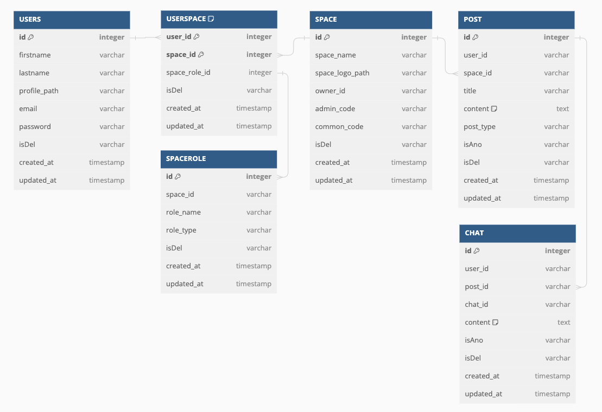

## Description

Dojoohwan 클라썸 과제

### 환경
- Node.js 18.17.1
- Nest.js 8.2.8
- TypeORM 0.2.41
- Typescript 4.9.5
- Mysql 8.0

## Installation

```bash
$ npm install
# Mysql 세팅
# dev : 3307 포트 / prod: 3308 포트
$ docker-compose up -d
```

## Running the app

```bash
# development
$ npm run start

# watch mode
$ npm run start:dev

# production mode
$ npm run start:prod
```

## ERD



## 디렉토리 구조
```
📦src
 ┣ 📂auth                           -> jwt 토큰, 로그인 검증 관련
 ┃ ┣ 📂guards                       
 ┃ ┃ ┣ 📜jwt-auth.guard.ts
 ┃ ┃ ┣ 📜jwt-service.guard.ts
 ┃ ┃ ┗ 📜local-service.guard.ts
 ┃ ┣ 📂security
 ┃ ┃ ┗ 📜payload.interface.ts
 ┃ ┣ 📂strategies                   
 ┃ ┃ ┣ 📜jwt-service.strategy.ts
 ┃ ┃ ┗ 📜local-service.strategy.ts
 ┃ ┣ 📜auth.controller.spec.ts
 ┃ ┣ 📜auth.controller.ts
 ┃ ┣ 📜auth.module.ts
 ┃ ┣ 📜auth.service.spec.ts
 ┃ ┗ 📜auth.service.ts
 ┣ 📂config                         -> config 관련
 ┃ ┗ 📜typeorm.config.ts
 ┣ 📂space                          -> 공간(space) 관련 
 ┃ ┣ 📂dto
 ┃ ┃ ┣ 📜create-param.dto.ts
 ┃ ┃ ┣ 📜create-space.dto.ts
 ┃ ┃ ┗ 📜join-space.dto.ts
 ┃ ┣ 📜space.controller.spec.ts
 ┃ ┣ 📜space.controller.ts
 ┃ ┣ 📜space.entity.ts
 ┃ ┣ 📜space.module.ts
 ┃ ┣ 📜space.service.spec.ts
 ┃ ┗ 📜space.service.ts
 ┣ 📂spacerole                      -> 공간 역할(spacerole) 관련 
 ┃ ┣ 📂dto
 ┃ ┃ ┗ 📜create-spacerole.dto.ts
 ┃ ┣ 📜spacerole.entity.ts
 ┃ ┣ 📜spacerole.module.ts
 ┃ ┗ 📜spacerole.service.ts
 ┣ 📂user                           -> 유저 (users) 관련 
 ┃ ┣ 📂dto
 ┃ ┃ ┣ 📜create-user.dto.ts
 ┃ ┃ ┣ 📜update-param.dto.ts
 ┃ ┃ ┗ 📜update-user.dto.ts
 ┃ ┣ 📜user.controller.spec.ts
 ┃ ┣ 📜user.controller.ts
 ┃ ┣ 📜user.entity.ts
 ┃ ┣ 📜user.module.ts
 ┃ ┣ 📜user.service.spec.ts
 ┃ ┗ 📜user.service.ts
 ┣ 📂userspace             -> 유저 공간(userspace) bridge 테이블 관련 
 ┃ ┣ 📂dto
 ┃ ┃ ┗ 📜create-userspace.dto.ts
 ┃ ┣ 📜userspace.entity.ts
 ┃ ┣ 📜userspace.module.ts
 ┃ ┣ 📜userspace.service.spec.ts
 ┃ ┗ 📜userspace.service.ts
 ┣ 📂utils                          
 ┃ ┗ 📂vaildate
 ┃ ┃ ┗ 📜is-in-array.ts             -> 유효성 검사를 위한 custom 데코레이터 생성
 ┣ 📜app.controller.spec.ts
 ┣ 📜app.controller.ts
 ┣ 📜app.module.ts
 ┣ 📜app.service.ts
 ┗ 📜main.ts
```

## API 정의
1. [Auth API](#auth-api)
    - [로그인](#login)
2. [Users API](#users-api)
    - [유저생성](#create-user)
    - [유저조회](#get-user)
    - [내정보조회](#get-user)
    - [내정보수정](#get-user)
3. [Space APIs](#space-apis)
    - [공간생성](#create-user)
    - [공간참여](#get-user)
    - [참여코드조회](#get-user)
    - [내공간조회](#get-user)
    - [역할삭제](#get-user)
    - [공간삭제](#get-user)

---

## Auth API

### 로그인
이메일과 비밀번호로 로그인을 한다.
성공시 토큰을 제공받고 이후 API를 토큰을 통해 인증할 수 있따.

**Endpoint:**  
`POST /auth/login`

**Request Body:**
```json
{
    "email": "ehwnghks@gmail.com",
    "password": "12345ehE!"
}
```
## Users API

### 유저 생성
유저를 생성한다.

**Endpoint:**  
`POST /user`

**Request Body:**
```json
{
  "email": "example@email.com",
  "firstname": "John",
  "lastname": "Doe",
  "password": "YourSecurePassword!"
}
```
-----
### 유저 조회
유저의 id 값으로 이메일 정보를 제외한 정보를 가져온다.

**Endpoint:**  
`GET /user/:id`

-----
### 내 정보 조회
로그인을 통해 얻은 유저의 id 값으로 정보를 조회한다.

**Endpoint:**  
`GET /user/myprofile`

------
### 내 정보 수정
이메일을 제외한 내 정보를 수정한다.

**Endpoint:**  
`PUT /user/myprofile`

**Request Body:**
```json
{
    "firstname" : "jooohwan"
}
```
